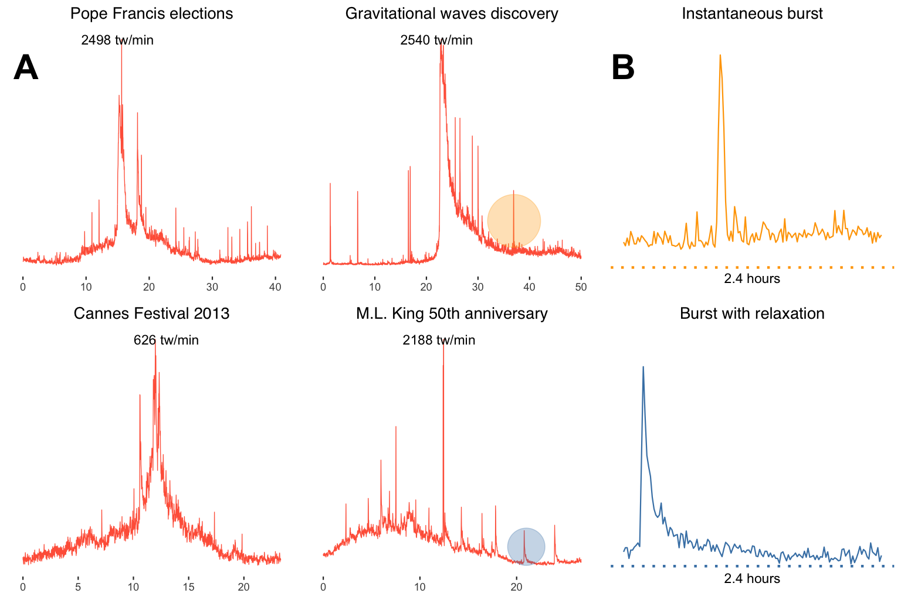
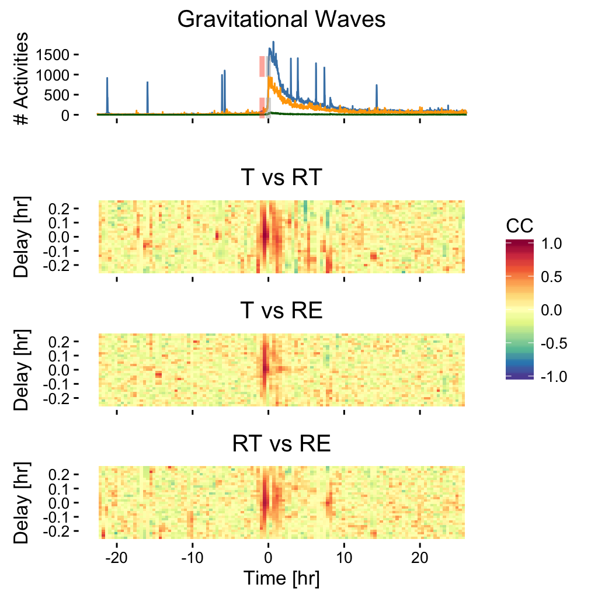
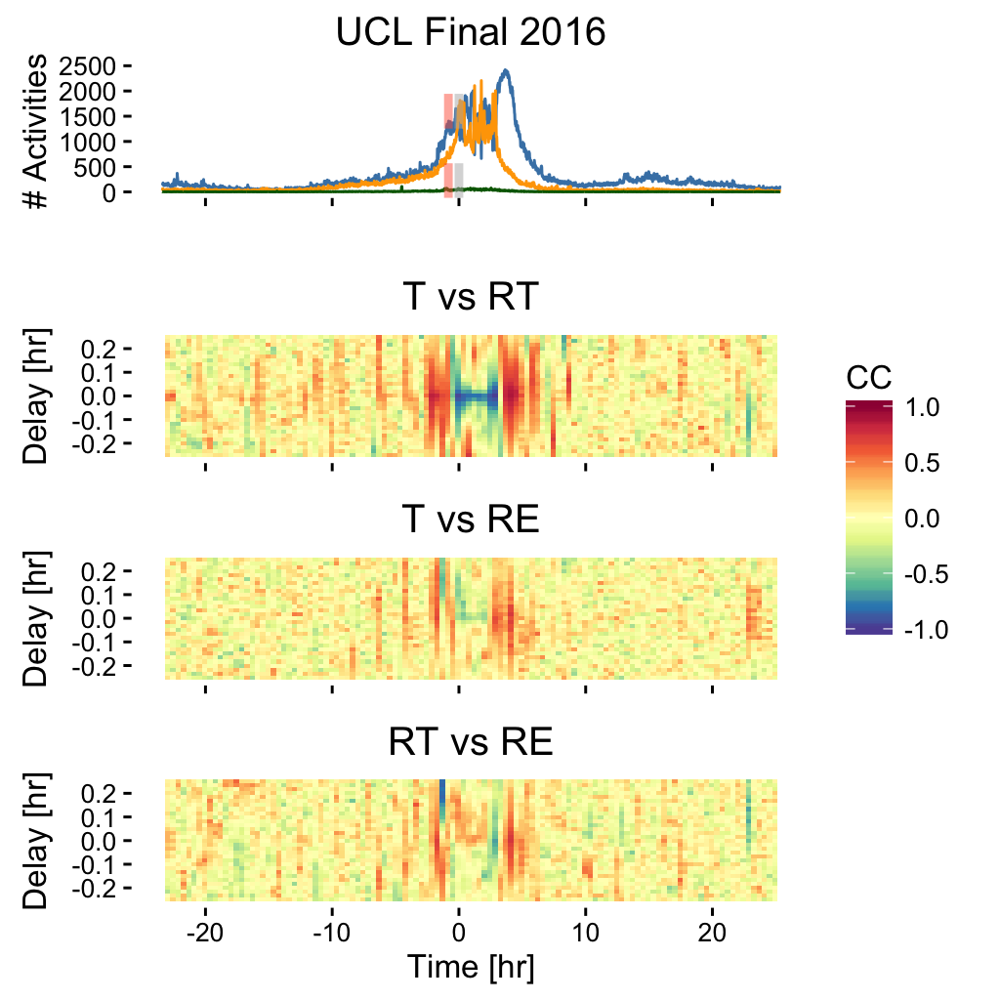

# SocialBursts Multiplex Networks

This repository provides free access (under the GNU GPL v3) to the multiplex networks used in the paper:

*Unraveling the Origin of Social Bursts in Collective Attention*

M. De Domenico and E.G. Altmann

Scientific Reports 10, 4629 (2020)

# Introduction

In the era of social media, every day billions of individuals produce content in socio-technical systems resulting in a deluge of information. However, human attention is a limited resource and it is increasingly challenging to consume the most suitable content for one's interests. In fact, the complex interplay between individual and social activities in social systems overwhelmed by information results in bursty activity of collective attention which are still poorly understood. 
In the aforementioned paper, we tackle this challenge by analyzing the online activity of millions of users in a popular microblogging platform during exceptional events, from NBA Finals to the elections of Pope Francis and the discovery of gravitational waves. We observe extreme fluctuations in collective attention that we are able to characterize and explain by considering the co-occurrence of two fundamental factors: the heterogeneity of social interactions and the preferential attention towards influential users. Our findings demonstrate how combining simple mechanisms provides a route towards complex social phenomena.

# Description

Four files are provided. Each file contains one network, corresponding to the exceptional events dataset analyzed in this paper, namely

|Type|Name|Event|Layers|Users|Interactions|
|----|----|-----------|------|-----|------------|
|Religion|`PopeElection2013`|Pope Francis election in 2013|3|2,064,866|5,969,189|
|Sport|`NBAFINALS2015`|NBA finals in 2015|3|747,937|2,150,187|
|Sport|`UCLFinal2016`|UEFA Champions League Final in 2016|3|677,145|1,673,492|
|Science|`GRAVITATIONAL_WAVES_2016`|Gravitational waves discovery in 2016|3|362,086|721,590|
|Culture|`Cannes2013`|Cannes Film Festival in 2013|3|438,537|1,180,173|
|Culture|`Sanremo2016_final`|Sanremo Italian Music Festival in 2016|3|56,562|461,838|
|Society|`BostonBomb2013`|Boston Attack in 2013|3|4,377,184|9,480,331|
|Society|`ParisAttack2015`|Paris Attacks in 2015|3|1,896,221|4,163,947|
|Society|`MLKing2013`|50th Anniv. of M.L. King's 'I have a dream'|3|327,707|398,230|

Layers correspond to retweet, mentions and replies aggregated over time and observed between users.
For more information abou the data collection, we refer to Tab. 1 and Methods of the paper.

The data is in extended edgelist format:

    layer nodeFrom nodeTo weight

For each event, we provide a separate file for the temporal activity in the following format:

    nodeFrom nodeTo timestamp interaction

Interaction can be **RT** (retweet), **MT** (mention) or **RE** (reply). Each link is directed. The user IDs in the above datasets are anonymized.

Note 1: the direction of links depends on the application, in general. For instance, if one is interested in building a network of how information flows, then the direction of RT should be reversed when used in the analysis. Nevertheless, the choice is left to the researcher and his/her own interpretation of the data, whereas we just provide the observed actions, i.e., who retweets/mentions/replies/follows whom.

Note 2: users mentioned in retweeted tweets are considered as mentions. For instance, if @A retweets the tweet “hello @C @D" sent by @B, then the following links are created: @A @B timeX RT, @A @C timeX MT, @A @D timeX MT, because @C and @D can be notified that they have been mentioned in a retweet. Similarly in the case of a reply. If for some reason the researcher does not agree with this choice, he/she can easily identify this type of links and remove the mentions, for instance.

|Cannes Film Festival|Gravitational Waves Discovery|
|----|----|
|_net.png)|_net.png)|

|||
|----|----|
|.png)||
|.png)|.png)|
|.png)|.png)|
|.png)||

# WARNING

Some data sets might not be available in this repository because they are too big. If you don't find the data set you are looking for, verify if it is available in [my website](https://manliodedomenico.com/data.php).

# Acknowledgments

The authors acknowledge the Max Planck Institute for the Physics of Complex Systems (Visitors program 2016).

# Credits

Please cite the accompanying paper, if you use one or more of data sets above in your study.

Note that the correct reference for the 

* Cannes Film Festival 
* 50th Anniv. of M.L. King's 'I have a dream'

data is:

E. Omodei, M. De Domenico, A. Arenas. - Characterizing interactions in online social networks during exceptional events. [Front. Phys. 3, 59 (2015)](https://www.frontiersin.org/articles/10.3389/fphy.2015.00059/full)
